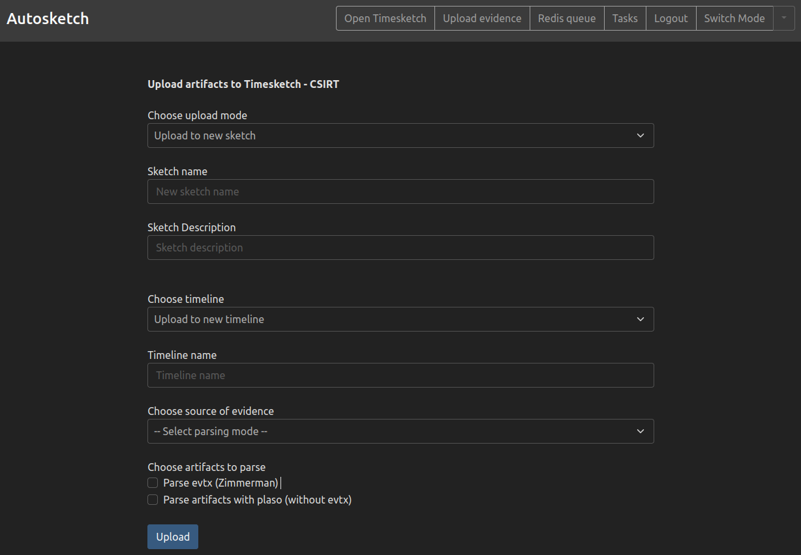

# Table of Contents
1. [About Autosketch](#about-autosketch)
2. [Deployment](#deployment)


# About Autosketch

Autosketch is an open-source framework to automate forensic workload and upload it to Timesketch. Autosketch allows you to make Plaso, run your favourite forensics tools and upload results into Timesketch with just few clicks. It is designed to be scalable and easily expandable with other tools.



## Data sources

Autosketch currently supports parsing evidence:
- from local storage,
- via web upload form,
- from S3 bucket,
- from Velociraptor hunt.

## Parsers

Even though Plaso is amazing tool, we also use other artifact-specific tools e.g. EvtxECmd from Eric Zimmerman.

In the current version Autosketch allows to run Plaso and/or EvtxEcmd on the evidence.

## Adjusters

From Timesketch documentation:
<br>"
The data that is ingested needs to have few fields already set before it can be ingested into Timesketch:

- message
- timestamp
- datetime."

Open-source parsers other than plaso doesn't produce data with those fields, Autosketch automates this step by adjusting output from EvtxECmd before uploading.

<br>

# Deployment

## Prerequisities 
 - docker-compose
 - Timesketch 

## Automated way
```
cd /opt
curl https://raw.githubusercontent.com/autodfir/Autosketch/main/deploy/deploy_as.sh > deploy_as.sh
chmod +x deploy_as.sh
sudo ./deploy_as.sh
```

### Manual way
 - copy etc/example-config.yaml directory to /opt/autosketch/etc/config.yaml
 - copy docker-compose.yaml to /opt/autosketch
 - edit TS_IP and TS_PORT to IP and PORT of Timesketch
 - docker-compose up -d
 

# Accessing Autosketch
After running docker-compose access Autosketch by visiting http://127.0.0.1:5001. To login use the same credentials as for Timesketch.

